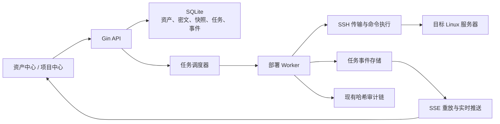

# Aurora AIOps 资产管理与项目部署设计

## 1. 背景与目标

Aurora AIOps 当前围绕一个已接入的 Kubernetes 集群提供资源查看、诊断、审批、修复与更新能力，但没有通用服务器资产、远程状态采集或项目部署能力。本设计增加一条独立且完整的资产运维链路：

1. 管理员可以新增服务器资产，服务器无需预装 Agent，也允许暂时离线或未初始化。
2. 平台通过免 Agent SSH 采集服务器状态、硬件、操作系统和已安装软件。
3. 用户可以进入服务器详情查看最新快照、项目安装和任务记录。
4. 项目中心提供 Aurora AIOps 和单机 Kubernetes 两个内置项目。
5. 管理员可以将 Aurora AIOps 安装到目标服务器，或一键部署单机标准 Kubernetes。
6. 所有部署任务持久化执行，通过 SSE 展示可恢复的阶段、百分比和脱敏日志。

产品名称继续使用 Aurora AIOps；代码仓库与发布源继续使用 `hougangbei/aurora-aiops`。

## 2. 已确认的设计决策

- 采用免 Agent SSH，不要求目标服务器提前安装平台代理程序。
- 新增资产时允许跳过连接测试；此类资产以 `pending` 状态保存。
- SSH 支持密码和私钥两种认证，私钥可带口令。
- 需要变更系统的项目安装只支持 `root` 或具备免密 `sudo` 的用户。
- 后台任务、步骤结果和事件全部写入 SQLite；浏览器刷新不会丢失进度。
- 首版 Kubernetes 安装为单机 `kubeadm` 标准集群，数据模型保留未来多节点角色。
- 首版内置项目只有 Aurora AIOps 和 Kubernetes，不开放任意命令或用户自定义脚本。
- 同一服务器最多执行一个变更任务，状态采集任务可并行。
- 服务器删除仅移除平台记录，不卸载远端软件；运行中任务存在时禁止删除。

## 3. 范围边界

### 3.1 本次范围

- 服务器资产 CRUD、连接测试、主机指纹确认与凭据轮换。
- 定时或手动采集在线状态、硬件、操作系统、软件包、系统服务和已安装项目。
- 资产列表、资产详情、项目中心、安装向导、任务抽屉和进度日志页面。
- Aurora AIOps Linux release 的选择、传输、校验、systemd 安装与健康检查。
- Ubuntu 22.04/24.04、Debian 12 上的单机 kubeadm 安装。
- 任务取消、重试、断线恢复、服务重启恢复和审计。

### 3.2 非目标

- 不在目标服务器安装常驻 Agent。
- 不提供浏览器 SSH 终端或任意远程命令执行功能。
- 不支持 Windows、macOS 服务器安装任务。
- 不在首版实现多控制面、多工作节点编排或集群扩缩容。
- 不把新部署的 Kubernetes 自动切换为 Aurora AIOps 当前共享 Kubernetes 客户端；服务器详情只展示该集群的安装与健康摘要。多集群管理是后续独立能力。
- 不承诺自动回滚所有已经改变的操作系统配置；取消和失败必须准确展示已完成步骤。

## 4. 总体架构

新增代码以 `server/internal/assets` 和 `server/internal/deployment` 为主要边界：

- `assets` 负责资产、凭据、主机指纹、状态快照与软件盘点，不了解具体项目安装步骤。
- `deployment` 负责任务状态机、步骤执行、事件、互斥、恢复和取消。
- `deployment/catalog` 提供内置项目定义；每个项目只暴露声明式元数据和版本化步骤。
- `server` 仅装配依赖并注册 HTTP/SSE 路由。
- 前端使用独立 `web/src/modules/assets` 模块，避免继续扩大 `services/cluster.ts`。

## 5. 数据模型

### 5.1 `asset_servers`

| 字段 | 说明 |
| --- | --- |
| `id` | UUID |
| `name` | 用户可读名称，必填且唯一 |
| `address` | IPv4、IPv6 或 DNS 名称 |
| `ssh_port` | 1–65535，默认 22 |
| `username` | SSH 用户 |
| `credential_id` | 当前凭据引用 |
| `host_key_fingerprint` | 首次成功连接确认的 SHA256 指纹，可为空 |
| `status` | `pending`、`online`、`offline`、`error` |
| `status_message` | 最新连接或采集摘要，不包含秘密 |
| `os_family` / `os_version` / `architecture` | 最新标准化系统信息 |
| `cpu_cores` / `memory_bytes` / `disk_bytes` | 最新容量摘要 |
| `last_seen_at` / `last_collected_at` | 最近在线与采集时间 |
| `created_at` / `updated_at` | 审计时间 |

地址和端口组合不强制唯一，便于经过不同跳板或 NAT 入口管理同一主机；名称必须唯一。

### 5.2 `asset_credentials`

凭据与资产分表，包含认证类型、随机 nonce、AES-GCM 密文、密钥版本和更新时间。API 的任何响应只返回认证类型和是否已配置，不返回 nonce、密文或解密结果。

主密钥来自 `AURORA_AIOPS_ASSET_ENCRYPTION_KEY`，格式为 base64 编码的 32 字节随机值。存在凭据记录但没有可用主密钥时，服务启动失败并给出配置错误，不能静默丢失凭据访问能力。

### 5.3 `asset_snapshots` 与软件明细

每次成功采集写入不可变快照，包含系统、CPU、内存、磁盘、网络、运行时间、负载和采集时间。软件明细按快照写入 `asset_software_items`：

- 系统包：名称、版本、架构、包管理器。
- 运行时：Docker、containerd、Podman。
- Kubernetes：kubeadm、kubelet、kubectl 和检测到的节点状态。
- 系统服务：名称、enabled/active 状态。
- Aurora 安装：版本、服务状态和健康地址。

列表默认展示最新快照；历史快照保留最近 30 次，后台采集后清理更旧记录。

### 5.4 项目与任务

- `project_catalog` 不存储任意脚本，只保存内置项目的标识、显示名称、描述、支持平台和当前推荐版本。
- `project_installations` 记录服务器、项目、版本、状态、安装路径、健康摘要和最后一次任务。
- `deployment_tasks` 记录服务器、项目、动作、状态、当前步骤、百分比、发起者、取消请求、错误和时间。
- `deployment_steps` 记录步骤编号、幂等键、状态、开始/完成时间和脱敏摘要。
- `deployment_events` 使用自增 ID 保存阶段、百分比、消息、日志级别和时间，供 SSE 断线重放。

任务状态为 `queued`、`running`、`succeeded`、`failed`、`cancelled`。百分比只能单调递增，终态不可再次变更；重试创建新任务并引用原任务 ID。

## 6. SSH 与资产采集

SSH 客户端使用 Go 原生库，统一设置连接、握手、命令和文件传输超时。所有目标地址在服务端校验，拒绝空地址、无效端口、URL 形式地址和包含控制字符的用户名。

### 6.1 主机指纹

- 跳过测试新增资产时，指纹为空。
- 第一次管理员触发连接时，API 返回待确认指纹，不执行采集或变更。
- 管理员确认后保存指纹并继续操作。
- 后续指纹变化一律失败，必须经过独立的管理员确认操作更新。
- 指纹确认和变更写入哈希审计链。

### 6.2 采集命令

采集器只执行固定命令集合，例如 `/etc/os-release`、`uname`、`uptime`、`free`、`df`、`ip`、`dpkg-query`、`rpm`、`apk`、`systemctl` 和受限的版本命令。命令输出设置字节上限；超过上限时截断并记录警告。

采集失败不会覆盖最后一次成功快照。资产状态改为 `offline` 或 `error`，详情页同时展示旧数据的采集时间和本次失败原因。

## 7. 项目中心

### 7.1 Aurora AIOps

项目卡展示描述、推荐版本、支持架构和已安装服务器数量。安装前选择目标服务器和版本。

安装步骤：

1. 连接与主机指纹校验（10%）。
2. 检测 Linux、架构、systemd、磁盘和权限（20%）。
3. 从 `hougangbei/aurora-aiops` Release 获取匹配的 `linux_amd64` 或 `linux_arm64` 资产（30%）。
4. 目标机下载，或由平台下载后通过 SFTP 上传（40%）。
5. 校验 `checksums.txt` 和 SHA256（50%）。
6. 解包到版本目录并原子更新 `/opt/aurora-aiops/current`（65%）。
7. 写入环境文件和 systemd unit；环境值不会出现在任务日志（78%）。
8. `systemctl daemon-reload`、enable、restart（90%）。
9. 轮询目标健康接口并记录安装版本（100%）。

发布流程必须产出 Linux amd64/arm64 资产；缺少目标架构资产时安装按钮禁用并给出原因。

### 7.2 单机 Kubernetes

首版支持 Ubuntu 22.04/24.04 和 Debian 12，使用 containerd、kubeadm、kubelet、kubectl 与 Cilium。Kubernetes 版本在项目定义中固定到受支持小版本，不使用不受约束的 `latest`。

安装步骤：

1. SSH、指纹、root/免密 sudo 检查（5%）。
2. OS、CPU、内存、磁盘、主机名、端口和网络预检（15%）。
3. 加载内核模块、写入 sysctl、关闭 swap 并持久化（28%）。
4. 安装并配置 containerd，使用 systemd cgroup（45%）。
5. 配置 Kubernetes 软件源并安装固定版本组件（60%）。
6. 执行带幂等检测的 `kubeadm init`（75%）。
7. 配置 kubeconfig，并为单节点调度移除 control-plane taint（80%）。
8. 安装固定版本 Cilium（88%）。
9. 等待 Node Ready 和核心 Pod Ready（96%）。
10. 加密保存 kubeconfig、版本和集群健康摘要（100%）。

如果检测到已有 Kubernetes，安装器先采集现状并停止，要求管理员明确选择“纳管现有安装”；首版不自动执行 `kubeadm reset`。

## 8. 任务引擎与进度

任务创建和服务器互斥锁在同一个 SQLite 事务内完成，避免双击或并发请求启动重复安装。Worker 从 `queued` 任务领取工作；每一步开始前检查取消标记，成功后原子保存步骤、百分比和事件。

步骤必须提供：

- 稳定的步骤 ID 和幂等检测。
- 明确的执行超时。
- 输出脱敏和大小限制。
- 成功判定，而不是仅依赖退出码。
- 可恢复性说明。

服务启动时，原 `running` 任务改回 `queued`，从最后一个成功步骤继续。无法安全恢复的步骤先执行只读探测；若远端结果不确定，任务进入 `failed`，要求人工重试，不能假装成功。

取消为尽力而为：终止当前 SSH 命令并阻止后续步骤，但保留已经完成的远端修改。UI 必须显示“已取消，部分步骤可能已生效”。

### 8.1 SSE

`GET /api/v1/deployment-tasks/:id/events` 返回标准 SSE：

- 支持 `Last-Event-ID` 和 `lastEventId` 查询参数。
- 先重放数据库中较新的事件，再订阅内存广播。
- 每 15 秒发送心跳。
- 每条事件包含任务状态、步骤、百分比、消息、级别和时间。
- 前端断线后自动重连；连续失败时改用 2 秒轮询任务详情。

## 9. API 与权限

### 9.1 资产 API

- `GET /api/v1/assets/servers`
- `POST /api/v1/assets/servers`
- `GET /api/v1/assets/servers/:id`
- `PATCH /api/v1/assets/servers/:id`
- `DELETE /api/v1/assets/servers/:id`
- `POST /api/v1/assets/servers/:id/test-connection`
- `POST /api/v1/assets/servers/:id/confirm-host-key`
- `POST /api/v1/assets/servers/:id/collect`
- `GET /api/v1/assets/servers/:id/snapshots/latest`
- `GET /api/v1/assets/servers/:id/software`
- `GET /api/v1/assets/servers/:id/installations`
- `GET /api/v1/assets/servers/:id/tasks`

### 9.2 项目与任务 API

- `GET /api/v1/projects`
- `GET /api/v1/projects/:id`
- `POST /api/v1/projects/:id/install`
- `POST /api/v1/projects/kubernetes/adopt`
- `GET /api/v1/deployment-tasks/:id`
- `GET /api/v1/deployment-tasks/:id/events`
- `POST /api/v1/deployment-tasks/:id/cancel`
- `POST /api/v1/deployment-tasks/:id/retry`

所有请求沿用现有 Session。权限规则为：

- viewer：读取资产、快照、软件、项目和任务。
- operator：viewer 权限，加手动状态采集和连接测试。
- admin：全部权限，包括新增、修改、删除、凭据、主机指纹、安装、纳管、取消和重试。

新增路由必须进入现有 `requiredPlatformRoles` 路由分类测试；未明确授权的写请求保持 admin 默认。

## 10. 前端信息架构

侧边栏增加“资产管理”分组：

- `服务器` → `/assets/servers`
- `项目中心` → `/assets/projects`

### 10.1 服务器列表

页面顶部展示总数、在线、离线、待连接和运行中任务统计。表格支持按状态、OS、架构和已安装项目筛选。右上角“新增服务器”打开抽屉：

- 名称、地址、端口、用户名。
- 密码或私钥认证。
- “保存后立即测试连接”开关，默认开启，可关闭。

保存离线资产成功后进入列表并显示“待连接”，而不是把连接失败当作创建失败。

### 10.2 服务器详情

详情头部展示状态、地址、系统、最后在线时间以及“刷新状态”“编辑”“安装项目”操作。标签页包括：

- 概览：CPU、内存、磁盘、负载、运行时间和网络。
- 软件：系统包、运行时、Kubernetes 组件、系统服务。
- 已安装项目：项目、版本、状态、安装路径和健康结果。
- 部署任务：状态、发起者、开始时间、进度、失败步骤和重试入口。

### 10.3 项目中心与进度

项目卡进入详情后选择服务器和版本。提交前展示将执行的步骤、权限要求和不可自动回滚提示。创建任务后打开任务详情抽屉：

- 顶部为状态和总进度条。
- 中部为步骤时间线，区分等待、运行、成功、失败和取消。
- 底部为自动滚动的脱敏日志，可暂停滚动和复制。
- 页面离开后，顶部全局任务入口继续显示运行任务数量。

Demo 模式提供固定的资产、项目和进度数据，但所有变更按钮保持禁用并明确标注只读演示。

## 11. 错误处理与审计

- 连接超时、认证失败、指纹不匹配、权限不足、平台不支持、空间不足、校验失败、命令超时和健康检查失败使用稳定错误码。
- API 返回面向用户的安全摘要；原始远端输出只在完成脱敏后进入事件表。
- 密码、私钥、私钥口令、sudo 信息、token、kubeconfig 和环境文件内容均加入统一敏感值脱敏器。
- 资产新增、编辑、删除、凭据轮换、指纹确认、采集、任务创建、取消、重试和每个任务终态写入现有哈希审计链。
- 审计载荷只保存资产 ID、项目 ID、版本、步骤和结果，不保存凭据或完整命令输出。

## 12. 测试与验收

### 12.1 自动化测试

- Repository：迁移、CRUD、唯一约束、快照保留、任务互斥和状态转换。
- 凭据：AES-GCM 往返、错误密钥、篡改检测、API/日志/审计无明文。
- SSH：密码、私钥、超时、取消、指纹首次确认和变化阻断。
- 采集：Debian/RPM/APK 输出解析、空输出、截断和失败保留旧快照。
- 安装器：命令顺序、步骤幂等、进度单调、失败恢复、取消和重试。
- 路由：请求校验、稳定错误码、完整 RBAC 矩阵和 SSE 重放。
- 前端：新增服务器、离线保存、详情标签页、项目选择、确认页、进度、断线恢复、失败重试和权限禁用。

SSH 集成测试使用临时 Linux SSH 容器，不访问真实生产服务器。安装脚本测试使用命令记录器和隔离文件系统，不能修改开发机。

### 12.2 人工端到端验收

准备一台空白受支持 Linux VM：

1. 关闭立即测试并新增资产，确认显示 `pending`。
2. 配置正确凭据、确认主机指纹并采集，确认状态、硬件和软件列表。
3. 安装 Aurora AIOps，确认每个进度阶段、远端 systemd 状态和健康接口。
4. 在另一台空白 VM 一键部署 Kubernetes，确认进度、`kubectl get nodes` 为 Ready、核心 Pod Ready。
5. 中断浏览器和 Aurora 服务后恢复，确认任务事件可重放且步骤不会重复破坏远端状态。
6. 验证 viewer/operator/admin 权限、审计链以及所有日志中没有凭据。

## 13. 交付分解

实现保持一个总体目标，但按依赖顺序分成四个可验证阶段：

1. 资产、加密凭据、SSH、主机指纹、采集 API 与资产页面。
2. 持久化任务引擎、互斥、恢复、SSE 和通用进度 UI。
3. Aurora AIOps 项目安装、Linux release 构建与安装验收。
4. 单机 kubeadm 项目、Cilium、健康采集与完整端到端验收。

每一阶段都必须通过后端测试、前端测试、构建、RBAC 分类和秘密扫描后才能进入下一阶段。
